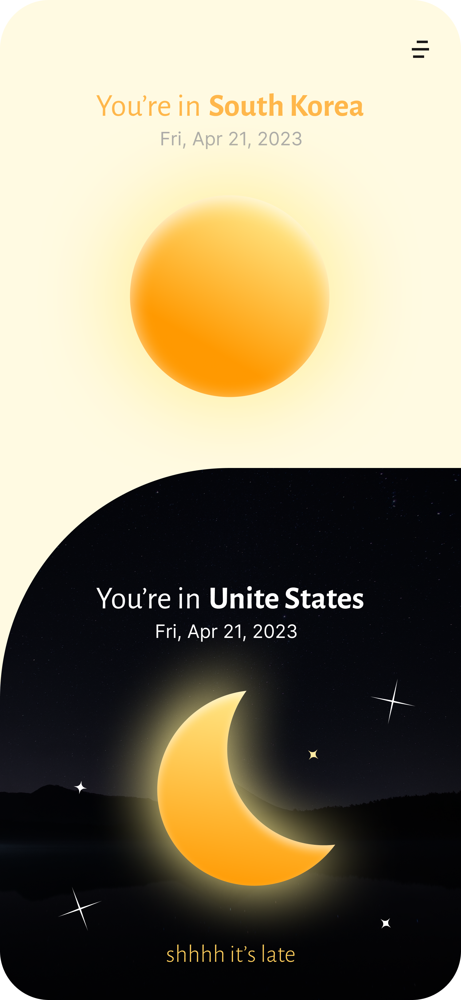
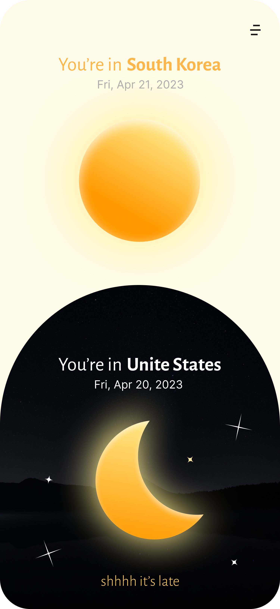
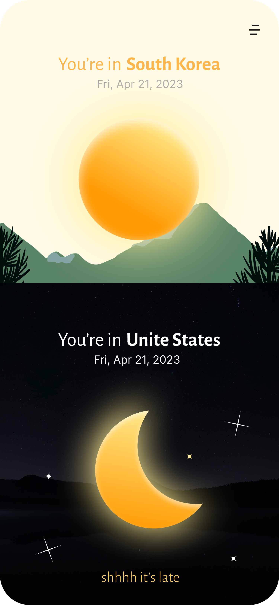
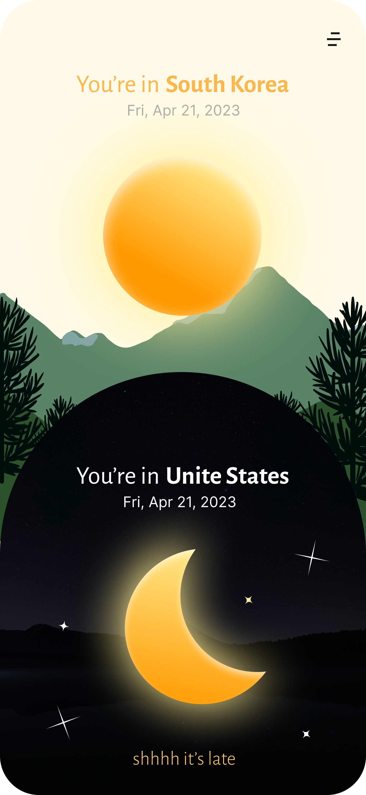

<a name="readme-top"></a>


<!-- PROJECT LOGO -->
<br />
<div align="center">
  <a href="https://github.com/ihanchoi/self-project"></a>

  <h2 align="center">Time Bridge & Time Syncer</h2>

  <p align="center">
    This is <b> Time bridge</b> mobile website for people who want to know the time of their loved ones living in other countries. 
    <br />

<!-- Feel free to use it :>
    <br />   -->

</div>


<br />
<!-- TABLE OF CONTENTS -->
<details>
  <summary>Table of Contents</summary>
  <ol>
    <li>
      <a href="#about-the-project">About The Project</a>
      <ul>
        <li><a href="#built-with">Built With</a></li>
      </ul>
    </li>
    <li>
      <a href="#getting-started">Getting Started</a>
      <ul>
        <li><a href="#prerequisites">Prerequisites</a></li>
        <li><a href="#installation">Installation</a></li>
      </ul>
    </li>
    <li><a href="#usage">Usage</a></li>
    <li><a href="#license">License</a></li>
    <li><a href="#acknowledgments">Acknowledgments</a></li>
  </ol>
</details>

<br />

<!-- ABOUT THE PROJECT -->
## About The Project
<div>
A mobile website that allows users to select two countries to compare times. It's designed for people who are going abroad, studying, immigrating, working holiday, or doing business and find themselves living in a different country from their loved ones. 
<br />
The date and time of the user's country is placed at the top, and the date and time of the country they want to check is placed at the bottom. 
<br /> 
The background color and design changes according to the time zone. 

<br />

- Morning - Yellow (sunrise)
- Afternoon - Skyblue (daylife)
- Evening - Black (night)

<br />
</div>

<p align="center" width="100%">




</p>

<br />

### Built With
* [![React][React.js]][React-url]
* [![Typescript][Typescript.io]][Typescript-url]
* Redux
* Tailwind

<br />

<!-- GETTING STARTED -->
## Getting Started

### Prerequisites

Upcoming updates ... 🛠


<br />

### Installation

1. Clone the repo
   ```sh
   git clone https://github.com/your_username_/Project-Name.git
   ```
2. Install NPM packages
   ```sh
   npm install
   ```
3. Upcoming updates ... 🛠


<br />

<!-- USAGE EXAMPLES -->
## Usage

Upcoming updates ... 🛠

<br />


<!-- LICENSE -->
## License

Distributed under the MIT License. See `LICENSE.txt` for more information.

<br />

<!-- ACKNOWLEDGMENTS -->
## Acknowledgments
* [Choose an Open Source License](https://choosealicense.com)
* [GitHub Emoji Cheat Sheet](https://www.webpagefx.com/tools/emoji-cheat-sheet)
* [Malven's Flexbox Cheatsheet](https://flexbox.malven.co/)
* [Malven's Grid Cheatsheet](https://grid.malven.co/)
* [Img Shields](https://shields.io)
* [GitHub Pages](https://pages.github.com)
* [Font Awesome](https://fontawesome.com)
* [React Icons](https://react-icons.github.io/react-icons/search)

<p align="right"><a href="#readme-top">back to top</a> ↑</p>


[React.js]: https://img.shields.io/badge/React-20232A?style=for-the-badge&logo=react&logoColor=61DAFB
[React-url]: https://reactjs.org/

[Typescript.io]: https://shields.io/badge/TypeScript-3178C6?logo=TypeScript&logoColor=FFF&style=flat-square
[Typescript-url]: https://www.typescriptlang.org

[Redux.js]: https://img.shields.io/badge/
[Redux-url]: https://redux.js.org
